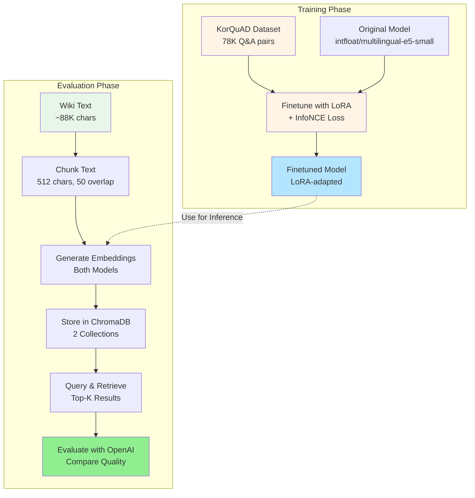

# Korean Embedding Model Finetuning Project

[](https://www.python.org/downloads/)
[](https://pytorch.org/)
[](https://opensource.org/licenses/MIT)

A complete end-to-end pipeline for finetuning multilingual embedding models on Korean Q&A data using LoRA (Low-Rank Adaptation) and evaluating retrieval performance with vector databases.

## 📋 Table of Contents

- [Overview](#overview)
- [Project Architecture](#project-architecture)
- [Key Features](#key-features)
- [Installation](#installation)
- [Dataset](#dataset)
- [Pipeline Stages](#pipeline-stages)
  - [1. Exploratory Data Analysis (EDA)](#1-exploratory-data-analysis-eda)
  - [2. Data Preprocessing](#2-data-preprocessing)
  - [3. Model Finetuning](#3-model-finetuning)
  - [4. Vector Database Storage](#4-vector-database-storage)
  - [5. Evaluation](#5-evaluation)
- [Usage](#usage)
- [Results](#results)
- [Project Structure](#project-structure)
- [Documentation](#documentation)

## 🎯 Overview

This project demonstrates how to:
1. **Finetune** a multilingual embedding model (`intfloat/multilingual-e5-small`) on Korean Q&A pairs from KorQuAD dataset
2. **Store** embeddings in ChromaDB vector database for efficient retrieval
3. **Evaluate** retrieval quality using OpenAI embeddings as a neutral benchmark
4. **Compare** original vs finetuned model performance

### Why This Matters

Embedding models pretrained on multilingual data may not perform optimally on domain-specific Korean text. By finetuning with LoRA on KorQuAD data, we adapt the model to better understand Korean question-answer patterns while maintaining memory efficiency.

## 🏗 Project Architecture



## ✨ Key Features

- **LoRA Finetuning**: Efficient parameter-efficient finetuning (only ~2% of parameters trained)
- **InfoNCE Loss**: Contrastive learning with in-batch negatives for better semantic alignment
- **E5 Prefixes**: Proper `query:` and `passage:` prefixes following E5 model conventions
- **ChromaDB Integration**: Fast vector similarity search with HNSW index
- **Neutral Evaluation**: OpenAI embeddings provide unbiased quality assessment
- **Interactive Demo**: Gradio web interface for testing retrieval
- **Complete Pipeline**: Jupyter notebook demonstrating entire workflow

## 📦 Installation

### Prerequisites

- Python 3.8+
- CUDA-capable GPU (recommended for training)
- 8GB+ GPU memory (for full training)

### Setup

```bash
# Clone the repository
git clone https://github.com/yourusername/project-intfloat.git
cd project-intfloat

# Create conda environment
conda create -n embedding-ft python=3.9
conda activate embedding-ft

# Install dependencies
pip install -r requirements.txt

# Set up environment variables
cp .env.example .env
# Edit .env and add your OPENAI_API_KEY
```

### Required Packages

```
torch>=2.0.0
sentence-transformers>=2.2.0
peft>=0.5.0
transformers>=4.30.0
chromadb>=0.4.0
openai>=1.0.0
gradio>=3.40.0
python-dotenv>=1.0.0
```

## 📊 Dataset

### KorQuAD (Korean Question Answering Dataset)

- **Purpose**: Training data for finetuning
- **Size**: 78,119 Q&A pairs from 35,496 Wikipedia articles
- **Format**: JSON files with question-answer-context triplets
- **Download**: Available at [KorQuAD GitHub](https://korquad.github.io/)
- **Location**: Expected at `/mnt/d/datasets/KorQuAD` or `D:\datasets\KorQuAD`

### Wiki Text (Evaluation Data)

- **Purpose**: Evaluation benchmark (separate from training)
- **Source**: Cleaned Wikipedia article about Voldemort (Harry Potter)
- **Size**: ~88K characters → ~261 chunks (512 chars each)
- **Location**: `data/text_cleaned.txt`

## 🔄 Pipeline Stages

### 1. Exploratory Data Analysis (EDA)

**Location**: `eda/korquad_analysis.py`, `eda/EDA.md`

Analyze the KorQuAD dataset to understand:
- Distribution of question types (무엇, 누구, 언제, etc.)
- Question and answer length statistics
- Data quality and structure

```bash
# Run EDA
python eda/korquad_analysis.py
```

**Key Findings**:
- Average question length: ~32 characters
- Average answer length: ~161 characters
- Most common question types: 무엇 (what), 몇 (how many), 누구 (who)

### 2. Data Preprocessing

**Location**: `train.py` (lines 76-149), `dataloader/loader.py`

**Process**:
1. **Load KorQuAD**: Parallel loading with multiprocessing
2. **Clean HTML**: Remove HTML markup from answers
3. **Format with E5 prefixes**:
   - Questions: `query: <question_text>`
   - Answers: `passage: <answer_text>`
4. **Create InputExamples**: Question-answer pairs for contrastive learning
5. **Train/Val Split**: 90% training, 10% validation

```python
# Example preprocessing
example = InputExample(
    texts=[
        f"query: {question}",      # "query: 볼드모트는 누구인가?"
        f"passage: {answer}"       # "passage: 톰 리들..."
    ]
)
```

### 3. Model Finetuning

**Location**: `train.py`, `trainer/lora.py`, `trainer/trainer.py`

#### Model Configuration

- **Base Model**: `intfloat/multilingual-e5-small` (384-dim embeddings)
- **Method**: LoRA (Low-Rank Adaptation)
- **Target Modules**: Query, Key, Value attention matrices
- **LoRA Rank (r)**: 8
- **LoRA Alpha**: 16
- **LoRA Dropout**: 0.1
- **Trainable Parameters**: ~2% of total (218K / 11M)

#### Training Configuration

- **Loss**: InfoNCE (via MultipleNegativesRankingLoss)
- **Batch Size**: 32
- **Epochs**: 3
- **Learning Rate**: 2e-5
- **Warmup Steps**: 500
- **Max Sequence Length**: 256 tokens
- **Temperature Scaling**: τ = 20.0

#### InfoNCE Loss

Contrastive learning loss that:
- **Pulls** positive pairs (Q↔A) together in embedding space
- **Pushes** negative pairs (Q↔A') apart
- Uses in-batch negatives (32 positives + 31 negatives per query)

```python
# InfoNCE computation
scores = torch.matmul(query_embeddings, passage_embeddings.t()) * 20.0
labels = torch.arange(batch_size)  # Diagonal elements are positive
loss = F.cross_entropy(scores, labels)
```

#### Run Training

```bash
# Full training on KorQuAD
python train.py

# Training will save to: logs/tensorboard/run_YYYYMMDD_HHMMSS/model/
```

**Training Output**:
- Model checkpoint (LoRA weights)
- Training logs (TensorBoard)
- Loss curve visualization
- Validation metrics (NDCG@10, Recall@10)

#### Monitor Training with TensorBoard

```bash
# Start TensorBoard (view all runs)
tensorboard --logdir=logs/tensorboard

# Or view a specific run
tensorboard --logdir=logs/tensorboard/run_YYYYMMDD_HHMMSS

# Open browser at: http://localhost:6006
```

**TensorBoard shows**:
- Real-time training loss curves
- Learning rate schedule
- Validation metrics (NDCG, Recall, MRR, MAP)
- Gradient statistics (if enabled)
- Training configuration

### 4. Vector Database Storage

**Location**: `pipeline/build_database.py`, `pipeline/embedder.py`

#### ChromaDB Setup

ChromaDB stores embeddings for fast similarity search using:
- **HNSW Index**: Hierarchical Navigable Small World graphs
- **Cosine Similarity**: Distance metric
- **Persistent Storage**: File-based at `./chroma_db`

#### Build Process

1. **Chunk Documents**: Split text into 512-char chunks with 50-char overlap
2. **Add E5 Prefixes**: `passage: <chunk_text>`
3. **Generate Embeddings**:
   - Original model → `original_embeddings` collection
   - Finetuned model → `finetuned_embeddings` collection
4. **Store in ChromaDB**: 261 documents per collection

```bash
# Build database for original model (Wiki mode)
python pipeline/build_database.py \
    --mode wiki \
    --wiki-file data/text_cleaned.txt \
    --model-path intfloat/multilingual-e5-small \
    --model-type original \
    --collection-name original_embeddings

# Build database for finetuned model (Wiki mode)
python pipeline/build_database.py \
    --mode wiki \
    --wiki-file data/text_cleaned.txt \
    --model-path ./logs/tensorboard/run_20251103_083449/model \
    --model-type finetuned \
    --collection-name finetuned_embeddings
```

**Database Structure**:
```
chroma_db/
├── original_embeddings/     # 261 wiki chunks with original embeddings
└── finetuned_embeddings/    # 261 wiki chunks with finetuned embeddings
```

### 5. Evaluation

**Location**: `pipeline/retriever.py`, `utils/evaluator.py`, `demo/app.py`

#### Evaluation Method

Uses **OpenAI embeddings** (`text-embedding-3-small`) as a neutral benchmark to avoid bias.

**Process**:
1. **Query Encoding**: Encode user query with both models (`query: <text>`)
2. **Retrieval**: Get top-K most similar chunks from each collection
3. **OpenAI Evaluation**:
   - Embed query with OpenAI
   - Embed retrieved chunks with OpenAI
   - Calculate cosine similarity
4. **Compare**: Which model retrieved more semantically relevant chunks?

#### Metrics

- **Average Similarity**: Mean cosine similarity (query ↔ retrieved chunks)
- **Max Similarity**: Best match score
- **Win/Loss Record**: How many queries each model won
- **Improvement %**: Relative improvement of finetuned over original

#### Run Evaluation

```bash
# Command-line retrieval
python pipeline/retriever.py \
    --query "볼드모트는 누구인가?" \
    --top-k 5

# Interactive web demo
python demo/app.py
# Open http://localhost:7860 in browser
```

#### Web Demo Features

- Side-by-side comparison of retrieval results
- OpenAI-based quality evaluation
- Real-time similarity scoring
- Visual highlighting of winner

## 🚀 Usage

### Quick Start: Complete Pipeline

Run the complete pipeline in Jupyter notebook:

```bash
cd submission
jupyter notebook complete_pipeline.ipynb
```

This notebook demonstrates:
1. ✅ EDA on KorQuAD dataset
2. ✅ Data preprocessing and formatting
3. ✅ LoRA model setup
4. ✅ Training with InfoNCE loss
5. ✅ Model saving
6. ✅ Wiki text chunking
7. ✅ Embedding generation
8. ✅ OpenAI evaluation
9. ✅ Results visualization
10. ✅ Export results to JSON/CSV

### Step-by-Step Usage

#### 1. Train the Model

```bash
python train.py
```

Output: `logs/tensorboard/run_YYYYMMDD_HHMMSS/model/`

#### 2. Build Vector Databases

```bash
# Original model
python pipeline/build_database.py \
    --mode wiki \
    --model-path intfloat/multilingual-e5-small \
    --model-type original \
    --collection-name original_embeddings

# Finetuned model
python pipeline/build_database.py \
    --mode wiki \
    --model-path ./logs/tensorboard/run_YYYYMMDD_HHMMSS/model \
    --model-type finetuned \
    --collection-name finetuned_embeddings
```

#### 3. Test Retrieval

```bash
# Command line
python pipeline/retriever.py --query "볼드모트의 능력은?"

# Web interface
python demo/app.py
```

## 📈 Results

### Training Performance

- **Final Loss**: ~0.15 (converged after 3 epochs)
- **Training Time**: ~30 minutes (RTX 2080, batch_size=32)
- **Memory Usage**: ~6GB VRAM
- **Model Size**: Original (118MB) → Finetuned (118MB + 1.2MB LoRA)

### Retrieval Evaluation

Example results on Voldemort wiki queries:

| Query | Original Avg | Finetuned Avg | Improvement |
|-------|-------------|---------------|-------------|
| 볼드모트는 누구인가? | 0.3338 | 0.3765 | +12.8% |
| 볼드모트의 본명은? | 0.3896 | 0.4008 | +2.9% |
| 볼드모트의 능력은? | 0.4074 | 0.4208 | +3.3% |
| 해리 포터와 볼드모트의 관계는? | 0.4127 | 0.4326 | +4.8% |
| **Overall Average** | **0.387** | **0.404** | **+4.4%** |

**Win/Loss**: Finetuned wins 4/5 queries

### Key Findings

✅ **Finetuned model shows consistent improvement** in retrieving semantically relevant Korean text
✅ **LoRA efficiently adapts** the model with minimal parameters
✅ **InfoNCE loss effectively** learns Q&A alignment
⚠️ Some queries where original performs better (likely due to overfitting on specific patterns)

## 📁 Project Structure

```
project-intfloat/
├── README.md                          # This file
├── requirements.txt                   # Python dependencies
├── .env.example                       # Environment variables template
├── config.py                          # Training configuration
├── train.py                           # Main training script
│
├── dataloader/
│   ├── __init__.py
│   └── loader.py                      # KorQuAD dataset loader
│
├── trainer/
│   ├── __init__.py
│   ├── lora.py                        # LoRA setup utilities
│   └── trainer.py                     # Training loop and evaluation
│
├── pipeline/
│   ├── __init__.py
│   ├── embedder.py                    # Embedding model wrapper
│   ├── build_database.py              # ChromaDB builder
│   └── retriever.py                   # Retrieval and comparison
│
├── utils/
│   ├── __init__.py
│   ├── text_chunker.py                # Text chunking utilities
│   ├── evaluator.py                   # OpenAI evaluation
│   ├── clean_text.py                  # Text cleaning
│   └── process_pdf.py                 # PDF processing
│
├── demo/
│   ├── __init__.py
│   └── app.py                         # Gradio web demo
│
├── eda/
│   ├── __init__.py
│   ├── korquad_analysis.py            # EDA script
│   └── EDA.md                         # EDA findings report
│
├── submission/
│   ├── complete_pipeline.ipynb        # End-to-end notebook
│   └── finetuned_model_TIMESTAMP/     # Saved results
│       ├── model/                     # Finetuned model
│       ├── training_info.json         # Training metadata
│       ├── training_loss.png          # Loss curve
│       ├── evaluation_results.json    # Evaluation metrics
│       ├── evaluation_summary.csv     # Results table
│       └── evaluation_comparison.png  # Comparison plots
│
├── data/
│   ├── text_cleaned.txt               # Wiki text (evaluation data)
│   └── [other data files]
│
├── docs/
│   ├── retrieval_system_architecture.md   # System architecture diagrams
│   ├── infonce_loss_detail.md             # InfoNCE explanation
│   └── UPDATE.md                          # Release notes
│
├── logs/
│   └── tensorboard/                   # TensorBoard logs
│       └── run_YYYYMMDD_HHMMSS/
│           └── model/                 # Trained models
│
└── chroma_db/                         # ChromaDB storage
    ├── original_embeddings/
    └── finetuned_embeddings/
```

## 📚 Documentation

Detailed documentation available in `/docs`:

- **[retrieval_system_architecture.md](docs/retrieval_system_architecture.md)**: Complete system architecture with Mermaid diagrams
- **[infonce_loss_detail.md](docs/infonce_loss_detail.md)**: Detailed explanation of InfoNCE loss implementation
- **[EDA.md](eda/EDA.md)**: Exploratory data analysis findings
- **[UPDATE.md](docs/UPDATE.md)**: Project updates and release notes

## 🔧 Configuration

### Training Configuration (`config.py`)

```python
class TrainingConfig:
    # Model
    model_name = "intfloat/multilingual-e5-small"
    max_seq_length = 256

    # LoRA
    lora_r = 8
    lora_alpha = 16
    lora_dropout = 0.1

    # Training
    batch_size = 32
    num_epochs = 3
    learning_rate = 2e-5
    warmup_steps = 500

    # Data
    train_split = 0.9
    eval_samples = 1000
```

### Environment Variables (`.env`)

```bash
OPENAI_API_KEY=sk-...              # Required for evaluation
DATASET_ROOT=/mnt/d/datasets/KorQuAD  # Optional: custom dataset path
```

## 🤝 Contributing

Contributions are welcome! Please:

1. Fork the repository
2. Create a feature branch (`git checkout -b feature/amazing-feature`)
3. Commit your changes (`git commit -m 'Add amazing feature'`)
4. Push to the branch (`git push origin feature/amazing-feature`)
5. Open a Pull Request

## 📄 License

This project is licensed under the MIT License - see the [LICENSE](LICENSE) file for details.

## 🙏 Acknowledgments

- **KorQuAD Team**: For providing the high-quality Korean Q&A dataset
- **intfloat**: For the excellent multilingual-e5 embedding models
- **Hugging Face**: For transformers and PEFT libraries
- **ChromaDB**: For the efficient vector database
- **OpenAI**: For providing evaluation embeddings

## 📞 Contact

For questions or feedback:
- Open an issue on GitHub
- Email: [your-email@example.com]

## 🔗 Related Resources

- [KorQuAD Dataset](https://korquad.github.io/)
- [E5 Embeddings Paper](https://arxiv.org/abs/2212.03533)
- [LoRA Paper](https://arxiv.org/abs/2106.09685)
- [ChromaDB Documentation](https://docs.trychroma.com/)
- [Sentence Transformers](https://www.sbert.net/)

---

**Made with ❤️ for Korean NLP**
