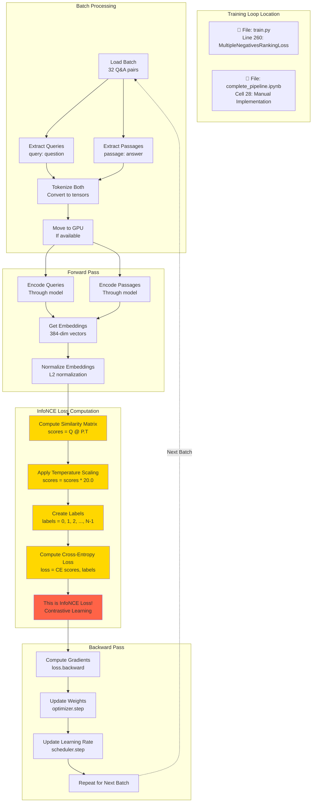

# InfoNCE Loss Implementation Detail

## Where InfoNCE Loss is Used

**InfoNCE (Information Noise Contrastive Estimation) Loss** is used **ONLY during the training phase** when finetuning the embedding model on KorQuAD data. It's NOT used during inference/retrieval.

## Training Loop with InfoNCE Loss



## InfoNCE Loss: Detailed Mathematics

```mermaid
flowchart LR
    subgraph Input Batch Size=32
        I1[Q1, Q2, ..., Q32<br/>32 Queries]
        I2[P1, P2, ..., P32<br/>32 Passages]
        I3[Positive Pairs:<br/>Q1↔P1, Q2↔P2, ..., Q32↔P32]
        I4[Negative Pairs:<br/>Q1↔P2, Q1↔P3, ...<br/>All other combinations]
    end

    subgraph Embedding Space
        E1[Query Embeddings<br/>Q ∈ ℝ^32×384]
        E2[Passage Embeddings<br/>P ∈ ℝ^32×384]
        E3[Normalize:<br/>||Q|| = 1, ||P|| = 1]
    end

    subgraph Similarity Matrix
        S1[Compute Dot Products<br/>S = Q @ P.T]
        S2[Matrix Shape:<br/>32 × 32]
        S3[Each row:<br/>1 positive + 31 negatives]
        S4[Apply Temperature:<br/>S = S × τ = 20.0]
    end

    subgraph InfoNCE Loss
        N1[For each query Qi:<br/>Positive: S_ii diagonal<br/>Negatives: S_ij j≠i]
        N2[Softmax over row:<br/>exp S_ij / Σ_k exp S_ik]
        N3[Cross-Entropy:<br/>-log softmax_ii]
        N4[Average over batch:<br/>Loss = mean CE]
    end

    I1 --> E1
    I2 --> E2
    E1 --> E3
    E2 --> E3
    E3 --> S1
    S1 --> S2
    S2 --> S3
    S3 --> S4
    S4 --> N1
    N1 --> N2
    N2 --> N3
    N3 --> N4

    style N4 fill:#FF6347
    style S4 fill:#FFD700
```

## Code Implementation

### Location 1: train.py (Sentence-Transformers Library)

```python
# Line 260 in train.py
from sentence_transformers import losses

# Use MultipleNegativesRankingLoss (built-in InfoNCE)
train_loss = losses.MultipleNegativesRankingLoss(model)
```

**This uses the library's implementation** which handles:
- In-batch negative sampling
- Temperature scaling
- Cross-entropy computation

---

### Location 2: complete_pipeline.ipynb (Manual Implementation)

```python
# Cell 28 - Training Loop

# 1. Get embeddings
query_embeddings = model(query_features)['sentence_embedding']  # Shape: [32, 384]
passage_embeddings = model(passage_features)['sentence_embedding']  # Shape: [32, 384]

# 2. Normalize (important for cosine similarity)
query_embeddings = F.normalize(query_embeddings, p=2, dim=1)
passage_embeddings = F.normalize(passage_embeddings, p=2, dim=1)

# 3. Compute similarity matrix (THIS IS THE KEY STEP!)
# Shape: [32, 32] - all query-passage pairs
scores = torch.matmul(query_embeddings, passage_embeddings.t()) * 20.0
#                                                                    ^^^^
#                                                          Temperature scaling τ=20

# 4. Create labels (diagonal elements are positive pairs)
# labels = [0, 1, 2, ..., 31]
# This means: Q0 matches P0, Q1 matches P1, etc.
labels = torch.arange(len(query_embeddings), device=device)

# 5. Compute InfoNCE loss using cross-entropy
# Cross-entropy with softmax: -log(exp(s_ii) / Σ_j exp(s_ij))
# This encourages: high score for positive pairs, low score for negative pairs
loss = F.cross_entropy(scores, labels)
# ^^^^^^^^^^^^^^^^^^^^^^^^^^^^^^^^^^^^^^^^
# THIS IS THE InfoNCE LOSS!
```

---

## Visual Explanation: How InfoNCE Works

```mermaid
flowchart TB
    subgraph Batch Batch_Size=4_Simplified
        B1[Query 1: 스위스의 수도는?]
        B2[Query 2: 볼드모트는 누구?]
        B3[Query 3: 태양계는 몇 개?]
        B4[Query 4: 한국의 수도는?]

        P1[Passage 1: 베른...]
        P2[Passage 2: 톰 리들...]
        P3[Passage 3: 8개...]
        P4[Passage 4: 서울...]
    end

    subgraph Similarity_Matrix After_Temperature
        direction TB
        SM[Q1-P1: 0.95✅ Q1-P2: 0.21❌ Q1-P3: 0.18❌ Q1-P4: 0.32❌<br/>Q2-P1: 0.25❌ Q2-P2: 0.89✅ Q2-P3: 0.15❌ Q2-P4: 0.28❌<br/>Q3-P1: 0.19❌ Q3-P2: 0.23❌ Q3-P3: 0.92✅ Q3-P4: 0.17❌<br/>Q4-P1: 0.31❌ Q4-P2: 0.26❌ Q4-P3: 0.20❌ Q4-P4: 0.94✅]
    end

    subgraph Loss_Computation
        direction TB
        LC1[For Q1: Want high Q1-P1 diagonal<br/>Want low Q1-P2, Q1-P3, Q1-P4]
        LC2[Softmax: Normalize row to probabilities]
        LC3[Cross-Entropy: -log probability of correct pair]
        LC4[InfoNCE pulls positive pairs together<br/>pushes negative pairs apart]
    end

    B1 --> SM
    B2 --> SM
    B3 --> SM
    B4 --> SM
    P1 --> SM
    P2 --> SM
    P3 --> SM
    P4 --> SM

    SM --> LC1
    LC1 --> LC2
    LC2 --> LC3
    LC3 --> LC4

    style SM fill:#FFD700
    style LC4 fill:#FF6347
```

## Key Characteristics of InfoNCE Loss

### 1. **In-Batch Negatives**
- Each query has 1 positive passage (its paired answer)
- Each query has (N-1) negative passages (other answers in the batch)
- Batch size 32 → 1 positive + 31 negatives per query

### 2. **Temperature Scaling (τ = 20.0)**
```python
scores = scores * 20.0
```
- Amplifies differences between similarities
- Higher temperature → sharper distribution
- Helps model learn better distinctions

### 3. **Symmetric Loss**
- Can compute loss from query→passage direction
- Can also compute from passage→query direction
- Often both directions are used and averaged

### 4. **Contrastive Learning**
- **Pull**: Increase similarity for positive pairs (Q1↔P1)
- **Push**: Decrease similarity for negative pairs (Q1↔P2, Q1↔P3, ...)

### 5. **Efficient Training**
- No need to mine hard negatives
- All other examples in batch serve as negatives
- Larger batch size → more negatives → better training

## When InfoNCE is Applied

| Phase | InfoNCE Loss Used? | Purpose |
|-------|-------------------|---------|
| **Training on KorQuAD** | ✅ **YES** | Finetune embedding model to understand Korean Q&A patterns |
| **Building ChromaDB** | ❌ **NO** | Just encode Wiki chunks and store embeddings |
| **Query/Retrieval** | ❌ **NO** | Just compute cosine similarity between query and stored embeddings |
| **Evaluation** | ❌ **NO** | Compare retrieval results, no training |

## Formula

The InfoNCE loss for a single query $q_i$ with positive passage $p_i^+$ and negative passages $\{p_j^-\}_{j≠i}$ is:

$$
\mathcal{L}_{\text{InfoNCE}} = -\log \frac{\exp(\text{sim}(q_i, p_i^+) / \tau)}{\sum_{j=1}^{N} \exp(\text{sim}(q_i, p_j) / \tau)}
$$

Where:
- $\text{sim}(q, p)$ = cosine similarity (dot product of normalized vectors)
- $\tau$ = temperature parameter (20.0 in this implementation)
- $N$ = batch size (32)

## Summary

**InfoNCE Loss Location:**
```
Training Phase
├── File: train.py (Line 260)
│   └── losses.MultipleNegativesRankingLoss(model)
│
└── File: complete_pipeline.ipynb (Cell 28)
    └── F.cross_entropy(scores, labels)
        ├── scores = Q @ P.T * 20.0
        └── labels = [0, 1, 2, ..., N-1]
```

**Purpose:** Train the model to produce embeddings where:
- Questions are close to their answers
- Questions are far from other answers
- This improves retrieval quality!
