# Retrieval System Architecture

## System Overview Flowchart


## Complete Pipeline: Training to Inference

```mermaid
flowchart LR
    subgraph Phase 1: Training
        direction TB
        TR1[📚 KorQuAD Dataset<br/>78K Q&A pairs]
        TR2[🔧 Finetune Model<br/>LoRA + InfoNCE Loss]
        TR3[💾 Save Finetuned<br/>Model Weights]

        TR1 --> TR2 --> TR3
    end

    subgraph Phase 2: Database Building
        direction TB
        DB1[📄 Wiki Text File<br/>data/text_cleaned.txt]
        DB2[✂️ Chunk Text<br/>~261 chunks]
        DB3[🔤 Add Prefixes<br/>passage: chunk]
        DB4{Embed with<br/>Both Models}
        DB5[📥 Original Model<br/>Encode chunks]
        DB6[📥 Finetuned Model<br/>Encode chunks]
        DB7[💿 Store in ChromaDB<br/>2 Collections]

        DB1 --> DB2 --> DB3 --> DB4
        DB4 --> DB5 --> DB7
        DB4 --> DB6 --> DB7
    end

    subgraph Phase 3: Inference
        direction TB
        INF1[❓ User Query]
        INF2[🔍 Search Both<br/>Collections]
        INF3[📊 Compare Results<br/>from Wiki chunks]

        INF1 --> INF2 --> INF3
    end

    TR3 -.->|Model Ready| DB6
    DB7 --> INF2

    style TR1 fill:#FFF4E6
    style TR2 fill:#FFF4E6
    style TR3 fill:#B4E5FF
    style DB1 fill:#E8F5E9
    style DB5 fill:#FFE5B4
    style DB6 fill:#B4E5FF
    style INF3 fill:#90EE90
```



## Database Building Flow (Wiki Text Only)

```mermaid
flowchart TB
    subgraph Input
        I1[📄 Wiki Text File<br/>data/text_cleaned.txt<br/>~88K characters]
        I2[🤖 Original Model<br/>intfloat/multilingual-e5-small]
        I3[🤖 Finetuned Model<br/>From Training Phase]
    end

    subgraph Text Processing
        direction TB
        P1[Load Wiki Text<br/>Read entire file]
        P2[Chunk Text<br/>Size: 512 chars<br/>Overlap: 50 chars]
        P3[Create Chunk Metadata<br/>title, chunk_index, heading]
        P4[Format as Pairs<br/>title, content]
        P5[~261 Chunks Created]

        P1 --> P2 --> P3 --> P4 --> P5
    end

    subgraph Embedding Generation
        direction TB
        E1[Add E5 Prefix<br/>passage: chunk_text]
        E2{Process with<br/>Both Models}
        E3[Original Model<br/>Batch Encode 32]
        E4[Finetuned Model<br/>Batch Encode 32]
        E5[Normalize Embeddings<br/>Cosine similarity ready]

        E1 --> E2
        E2 --> E3 --> E5
        E2 --> E4 --> E5
    end

    subgraph ChromaDB Storage
        direction TB
        C1[Create Collections<br/>cosine similarity space]
        C2[Original Collection<br/>Store 261 embeddings]
        C3[Finetuned Collection<br/>Store 261 embeddings]
        C4[Persist to Disk<br/>./chroma_db]
        C5[Metadata Stored:<br/>- Chunk text<br/>- Title<br/>- Index]

        C1 --> C2
        C1 --> C3
        C2 --> C4
        C3 --> C4
        C2 --> C5
        C3 --> C5
    end

    I1 --> P1
    I2 --> E3
    I3 --> E4
    P5 --> E1
    E5 --> C1

    style I1 fill:#E8F5E9
    style I2 fill:#FFE5B4
    style I3 fill:#B4E5FF
    style E3 fill:#FFE5B4
    style E4 fill:#B4E5FF
    style C2 fill:#FFE5B4
    style C3 fill:#B4E5FF
    style C4 fill:#90EE90
```



## Query Retrieval Flow (Wiki-based)

```mermaid
flowchart TB
    subgraph User Input
        U1[User Query<br/>Example: 볼드모트는 누구인가?]
        U2[Parameters<br/>top_k=5<br/>model_type=both]
    end

    subgraph Query Encoding
        direction TB
        E1[Add Query Prefix<br/>query: 볼드모트는 누구인가?]
        E2{Encode with<br/>Both Models}
        E3[Original Model<br/>Encode query]
        E4[Finetuned Model<br/>Encode query]
        E5[Normalize Embeddings]

        E1 --> E2
        E2 --> E3 --> E5
        E2 --> E4 --> E5
    end

    subgraph Vector Search in ChromaDB
        direction TB
        V1[Search Original<br/>Wiki Collection]
        V2[Search Finetuned<br/>Wiki Collection]
        V3[Compute Cosine<br/>Distance]
        V4[Rank Wiki Chunks<br/>by Similarity]
        V5[Return Top-5<br/>Wiki Chunks]

        V1 --> V3
        V2 --> V3
        V3 --> V4
        V4 --> V5
    end

    subgraph Result Formatting
        direction TB
        F1[Extract Wiki Chunk<br/>Metadata]
        F2[Calculate Similarity<br/>score = 1.0 - distance]
        F3[Format Results<br/>rank, score, wiki_text]
        F4[Group by Model<br/>original vs finetuned]

        F1 --> F2 --> F3 --> F4
    end

    subgraph Output Display
        O1[Original Model Results<br/>Top-5 Wiki chunks<br/>with scores]
        O2[Finetuned Model Results<br/>Top-5 Wiki chunks<br/>with scores]
        O3[Side-by-Side<br/>Comparison<br/>Which retrieves better?]
        O4[Performance Metrics<br/>Score comparison]

        O1 --> O3
        O2 --> O3
        O3 --> O4
    end

    U1 --> E1
    U2 --> E2
    E5 --> V1
    E5 --> V2
    V5 --> F1
    F4 --> O1
    F4 --> O2

    style E3 fill:#FFE5B4
    style E4 fill:#B4E5FF
    style V1 fill:#FFE5B4
    style V2 fill:#B4E5FF
    style O1 fill:#FFE5B4
    style O2 fill:#B4E5FF
    style O3 fill:#90EE90
```



## Component Architecture


## Data Flow Sequence Diagram

```mermaid
sequenceDiagram
    participant User
    participant Demo as Demo App
    participant Retriever as RAG Retriever
    participant OModel as Original Model
    participant FModel as Finetuned Model
    participant ODB as Original DB<br/>(Wiki chunks)
    participant FDB as Finetuned DB<br/>(Wiki chunks)

    Note over User,FDB: User submits query about Wiki content
    User->>Demo: Query: "볼드모트는 누구인가?"
    Demo->>Retriever: search(query, top_k=5, model_type="both")

    par Original Model Path
        Retriever->>OModel: encode_query("query: 볼드모트는 누구인가?")
        OModel-->>Retriever: query_embedding
        Retriever->>ODB: query(query_embedding, n_results=5)
        Note over ODB: Search 261 Wiki chunks
        ODB-->>Retriever: top-5 Wiki chunks + distances
    and Finetuned Model Path
        Retriever->>FModel: encode_query("query: 볼드모트는 누구인가?")
        FModel-->>Retriever: query_embedding
        Retriever->>FDB: query(query_embedding, n_results=5)
        Note over FDB: Search 261 Wiki chunks
        FDB-->>Retriever: top-5 Wiki chunks + distances
    end

    Retriever->>Retriever: Format results<br/>(rank, score, wiki_text)
    Retriever-->>Demo: {original: [wiki chunks],<br/>finetuned: [wiki chunks]}
    Demo->>Demo: Format for display
    Demo-->>User: Show side-by-side comparison<br/>of Wiki retrieval results
```



## Key System Characteristics

### 1. **Clear Data Separation**
- **Training**: KorQuAD Q&A pairs (78K) → Finetune embedding model
- **Evaluation/Inference**: Wiki text chunks (~261) → Retrieval benchmark

### 2. **Model Comparison Setup**
- **Original Model**: intfloat/multilingual-e5-small (baseline)
- **Finetuned Model**: Same model + LoRA adaptation (trained on KorQuAD)
- **Goal**: Compare retrieval performance on Wiki content

### 3. **E5 Embedding Conventions**
- Queries: `query: <text>`
- Wiki Chunks: `passage: <text>`
- Ensures proper semantic alignment

### 4. **ChromaDB Storage**
- Persistent file-based storage (`./chroma_db`)
- HNSW index for fast similarity search
- Cosine similarity metric
- Two separate collections (one per model)
- Each collection contains 261 Wiki chunk embeddings

### 5. **Wiki Text Processing**
- Source: `data/text_cleaned.txt` (~88K characters)
- Chunking: 512 characters with 50 character overlap
- Result: ~261 chunks
- Metadata: title, chunk_index, heading

### 6. **Retrieval Evaluation**
- User queries about Wiki content (e.g., Harry Potter topics)
- Both models retrieve from their respective Wiki collections
- Compare which model retrieves more relevant chunks
- Metrics: similarity scores, rank comparison

### 7. **Workflow Summary**
```
Training:     KorQuAD → Finetune Model
Building:     Wiki Text → Chunk → Embed (both models) → ChromaDB
Inference:    User Query → Search Wiki Collections → Compare Results
```

## Example Use Case

**Training Phase:**
- Load 78K Q&A pairs from KorQuAD
- Finetune intfloat model with LoRA on Korean Q&A task
- Save finetuned model

**Database Building Phase:**
- Load Wiki text about Harry Potter (Voldemort)
- Chunk into 261 pieces
- Generate embeddings with BOTH original and finetuned models
- Store in separate ChromaDB collections

**Inference Phase:**
- User asks: "볼드모트는 누구인가?" (Who is Voldemort?)
- Original model searches its Wiki collection → returns top-5 chunks
- Finetuned model searches its Wiki collection → returns top-5 chunks
- Compare: Which model found more relevant Wiki chunks?
- Result: Finetuned model typically scores higher due to Korean language adaptation

---

## InfoNCE Loss Details

**🔥 InfoNCE Loss is used ONLY during the Training Phase!**

For detailed explanation of InfoNCE loss computation, see: [`docs/infonce_loss_detail.md`](./infonce_loss_detail.md)

**Quick Summary:**
- **Where**: Training loop when finetuning on KorQuAD
- **What**: Contrastive loss that pulls positive pairs (Q↔A) together and pushes negative pairs apart
- **Implementation**:
  ```python
  # Compute similarity matrix (batch_size × batch_size)
  scores = torch.matmul(query_embeddings, passage_embeddings.t()) * 20.0

  # Labels: diagonal elements are positive pairs
  labels = torch.arange(batch_size, device=device)

  # InfoNCE loss via cross-entropy
  loss = F.cross_entropy(scores, labels)
  ```
- **Not Used During**: Database building, retrieval, or evaluation (only training!)
